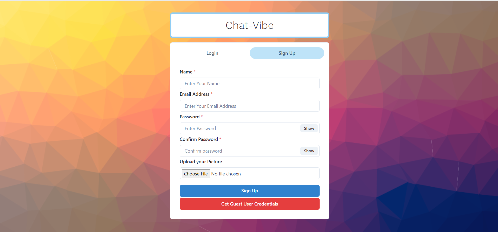
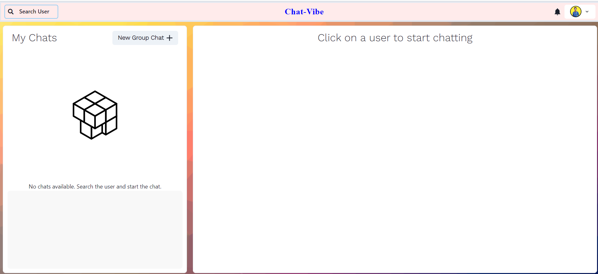
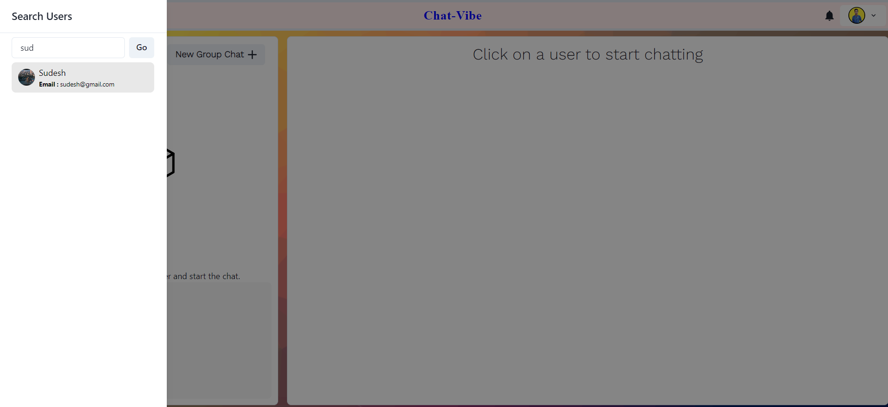
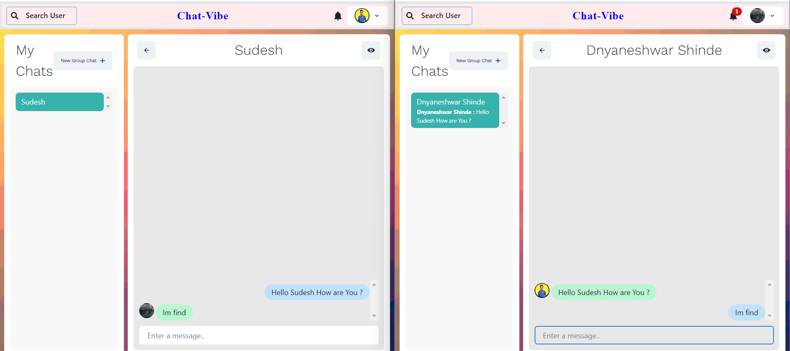
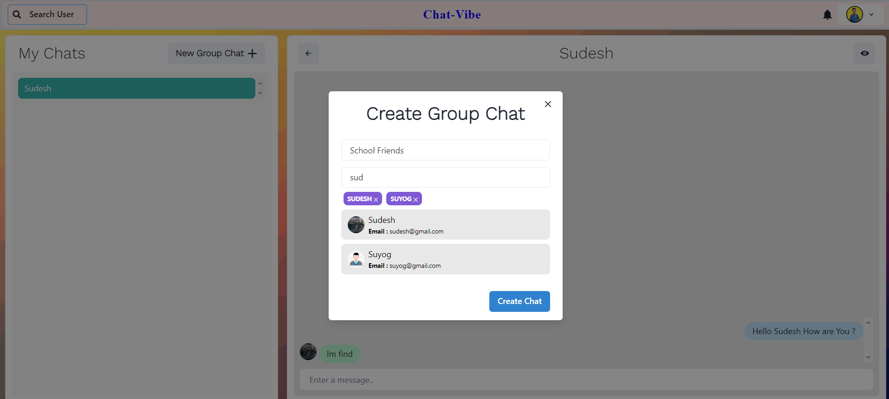
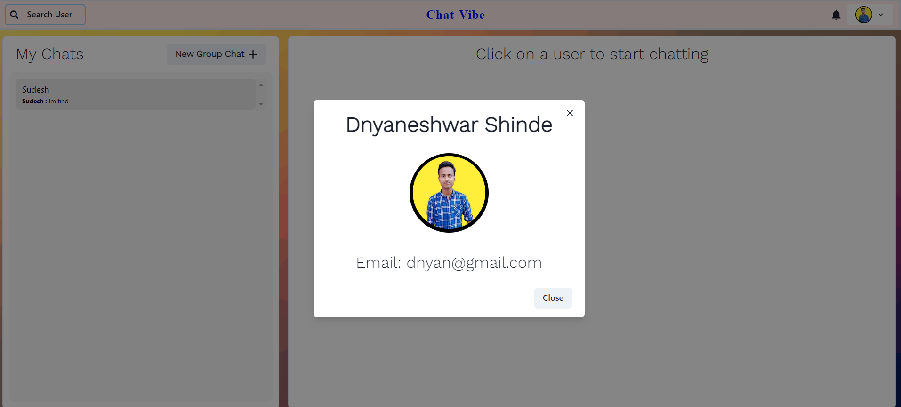

# Chat-Vibe

**Chat-Vibe** is a user-friendly website that offers real-time chat capabilities, allowing users to connect, chat, and collaborate with others. Chat-Vibe provides a seamless chatting experience where users can exchange messages in real-time. It also allows users to create groups for collaborative discussions and receive notifications for new messages. With secure authentication, users can ensure their privacy and enjoy a safe communication environment.

## Features

- User Auth and Profile setup
- Real-time chat functionality for instant messaging.
- One to One Chat
- Create Group Chat 
- User search functionality
- Real time notifications

## Tech Stack

**Client:** ReactJS, Chakra Ui

**Server:** Node.js, Express.js

**Database:**  MongoDB

**Programming Language:** Javascript

**Socket.io for real time communication between users**

